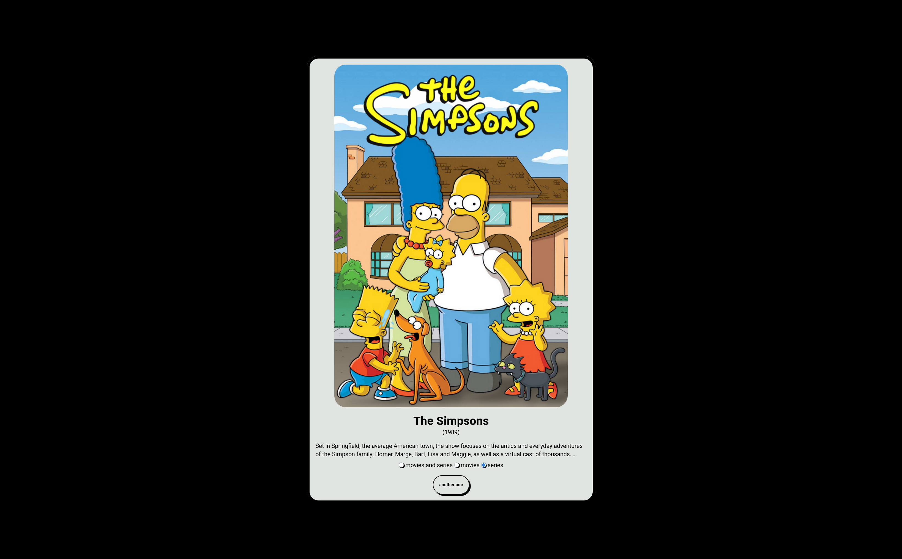
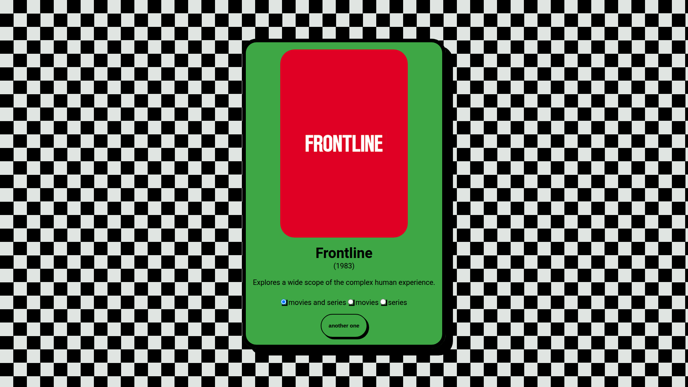
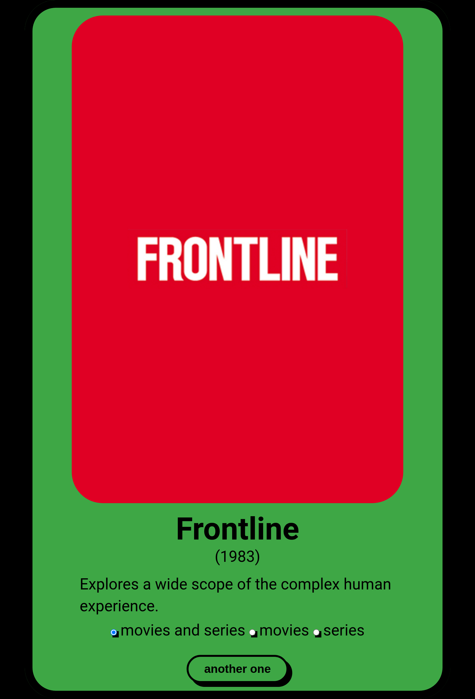

# sommelierr

A refined selection from your Radarr and Sonarr cellars.

|                                                Plain style horizontal layout                                                 |                                              Plain style vertical layout                                               |
| :--------------------------------------------------------------------------------------------------------------: | :--------------------------------------------------------------------------------------------------------: |
|  |  |
|                                                Horizontal layout                                                 |                                              Vertical layout                                               |
|  |  |

## Published On

- [selfh.st](https://selfh.st/weekly/2025-09-26/)

## Dependencies

- [go](https://go.dev/)
- Optional:
  - [docker](https://docs.docker.com/)

## Relevant documentation

- [Radarr API](https://radarr.video/docs/api/)
- [Sonarr API](https://sonarr.tv/docs/api)

## Installation

### With Docker

#### docker-compose

1. Configure `.env` (see the configuration section below).
1. Run it.

   ```bash
   docker compose up --detach
   ```

#### docker build & run

1. Build the docker image.

   ```bash
   docker build . --tag sommelierr
   ```

1. Configure `.env` (see the configuration section below).
1. Run it.

   ```bash
    docker run --rm --read-only --pull always --env-file .env --publish 8080:8080 --cap-drop ALL --security-opt no-new-privileges:true --cpus 2 -m 64m --pids-limit 16 ghcr.io/rare-magma/sommelierr:latest
    ```

1. Open Sommelierr's UI @ <http://localhost:8080>

### Manually

1. Build it:

   ```bash
   go build -ldflags "-s -w" -trimpath -o sommelierr ./cmd/server
   ```

2. Run it:

   ```bash
   ./sommelierr
   ```

3. Open Sommelierr's UI @ <http://localhost:8080>

### Environment file

The env file has a few options:

```plaintext
EXCLUDE_LABEL=watched
RADARR_HOST=https://radarr.example.com
RADARR_API_KEY=aaaaaaaaaaaaaaaaaaaaaaaaaaaaaaaa
SONARR_HOST=https://sonarr.example.com
SONARR_API_KEY=bbbbbbbbbbbbbbbbbbbbbbbbbbbbbbbb
PORT=8080
PLAIN_STYLE=true
```

- `EXCLUDE_LABEL` should be the label of the tag used to exclude already watched movies/series. This is optional.
- `RADARR_HOST` should be the FQDN of the Radarr service.
- `RADARR_API_KEY` should be the Radarr api key. This is configured in Settings - General - API Key
- `SONARR_HOST` should be the FQDN of the Sonarr service.
- `SONARR_API_KEY` should be the Sonarr api key. This is configured in Settings - General - API Key
- `PORT` should be the port available for Sommelierr to attach to. Defaults to 8080
- `PLAIN_STYLE` use a plain black and white style sheet. Defaults to false

## Usage

Open sommelierr in the browser. By default sommelierr displays a random movie or series from the configured Radarr and Sonarr instances. You can choose to get only movies or series by selecting the corresponding option and clicking the "another one" button.

If the `EXCLUDE_LABEL` option is set up then sommelierr will query Radarr and Sonarr for all the movies/series that don't include that label. This way only movies/series that have been watched show up in the recommendations.

Clicking on the poster image opens the movie/series page in Radarr/Sonarr.

The description text will be hidden if it is long. Click on it to reveal the full description.

## Troubleshooting

Check the service logs for errors with Radarr/Sonarr's API.

## Credits

- [Radarr](https://radarr.video/)
- [Sonarr](https://sonarr.tv/)
